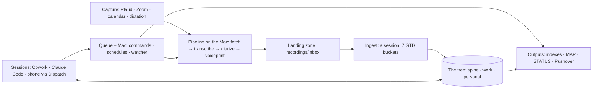
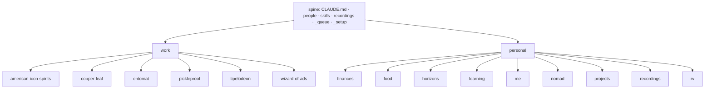
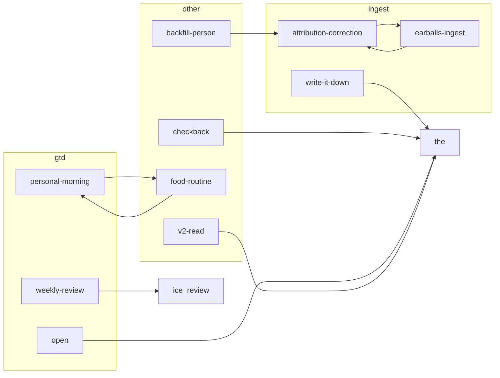
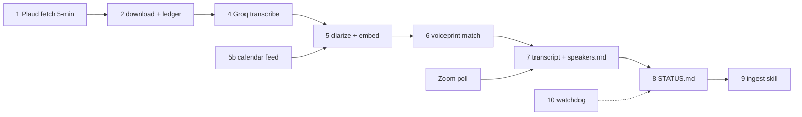

# Sancho · MAP
generated 2026-10-02 by build-map.py. Three zoom levels; Level 0 is the picture to remember.

## FOCUS

# FOCUS   (cap: 3 per lobe per horizon; lint-enforced; hand-set with Gordon, never generated)
## month · 2026-09
work:     Build Sancho · (open) · (open)
personal: (open) · (open) · (open)
## week · 2026-09-30
work:     scaffold + pipeline running · (open) · (open)
personal: (open) · (open) · (open)
## today · 2026-09-30
work:     scaffold the tree · first lint/index/map run · (open)
personal: (open) · (open) · (open)
exceptions this week: 0

## Level 0 · the system

## Level 1 · components

### The tree

### Skills by family

### Pipeline stages

### Active projects

- **Plan the Alaska trip (2027)** (personal/nomad) · next: Read 07-open-questions.md and pick the first one to close
- **Food routine to habit** (personal/food) · next: Design the Sunday session skill (build order #6); first session picks four dinners
- **Nomad daily check** (personal/nomad) · next: Design the personal morning routine incl. the nomad check (build order #5)
- **Build Sancho** (work/copper-leaf) · next: Claude Code on the Mac: watcher, launchd, Sancho-Audio, Sancho-Secrets, Sancho-Private, autocommit fix, ping
- **Home Directions system rebuild** (work/copper-leaf) · next: Build running overnight from this thread since 2026-10-02 00:55 (kit, app and paperwork tracks; state in docs/build-state.md). Gordon in the morning: read the summary at the top of docs/build-log.md, then the account checklist in docs/runbook-accounts.md

## Changed this week

- .gitignore
- CLAUDE.md
- FOCUS.md
- INDEX.md
- MAP.md
- _design/STATUS.md
- _design/Sancho-Architecture-standalone.html
- _design/architecture.md
- _design/build-reading-copy.py
- _design/decisions.md
- _design/migration-plan.md
- _design/postmortem.md
- _design/routines-capture.md
- _design/sancho-architecture.html
- _design/sancho-tree.html
- _design/seeds/goals.md
- _design/seeds/mantras.md
- _design/seeds/to-read.md
- _design/seeds/work-ice.md
- _quarantine/.gitkeep
- _quarantine/2026-10-01_ingest-pending-requests.md
- _queue/checkbacks.md
- _queue/jobs/2026-09-30_build-sancho.md
- _queue/jobs/2026-10-01_backfill-people.md
- _queue/jobs/_archive/.gitkeep
- _queue/jobs/_archive/2026-09-30_jobrun-smoke.md
- _setup/ERRORS.md
- _setup/GIT-EXCLUDED.md
- _setup/LINT.md
- _setup/MAC-SETUP.md
- _setup/README.md
- _setup/TESTS.md
- _setup/build-index.py
- _setup/build-map.py
- _setup/com.sancho.autocommit-private.plist
- _setup/com.sancho.nightly.plist
- _setup/com.sancho.pipeline.plist
- _setup/com.sancho.tests.plist
- _setup/com.sancho.watcher.plist
- _setup/commands.md
- _setup/git-autocommit.sh
- _setup/hooks/INDEX.md
- _setup/index-manifest.json
- _setup/install-mac.sh
- _setup/job-run.py
- _setup/lint-layers.py
- _setup/metered-networks.md
- _setup/nerd-lease.py
- _setup/nerd-run.py
- _setup/nerd-settings.json
- _setup/netstate.py
- _setup/nightly.sh
- _setup/nomad-brief.py
- _setup/notify-reasons.md
- _setup/notify-test.sh
- _setup/notify.py
- _setup/ping.sh
- _setup/pipeline/INDEX.md
- _setup/pipeline/earballs.py
- _setup/pipeline/earballs.sh
- … +634 more

## Level 2 · wiring

Skills: triggers, reads, writes, tests

| skill | lobe | triggers | must not | reads | writes | test |
|---|---|---|---|---|---|---|
| attribution-correction | both | that's not <name>, that was <name> not <name>, swap them, flip that, wrong speaker, that's me, a speaker correction given during earballs-ingest | a correction of a misheard word (that is corrections.md, in earballs-ingest), a correction of a fact that is not about who said it, a machine candidate Gordon merely declines to confirm | the recording's speakers.md, transcript.md, summary, every file whose sources: lists that rec_id (ripgrep), recordings/STATUS.md, people/<old>.md and people/<new>.md | speakers.md (old row struck, new row by: gordon), people/<old>.md voiceprint: auto paused 90 days, every affected file: superseded lines + corrected lines, the summary's Speakers footer, _queue/requests/ (pipeline.library, pipeline.rematch), the entity's or lobe's decisions.md, the session note | _setup/tests/skills/attribution-correction/ |
| backfill-person | both | backfill <person>, build a file for <person>, "who is <person>" when no people file exists, a stage of the backfill-people job, earballs-ingest meeting a slug with no file | a question about someone with a full file (read it instead), a request to add one fact (write-it-down), anything about Gordon himself (personal/me/ is his), a person Gordon has named as off limits | people/<slug>.md if it exists, rg -l '<name>|<slug>' across work/ personal/ recordings/ (summaries, entity and knowledge files, transcripts), legacy evidence only through v2-read (subagent) or a nerd.run session started with SANCHO_QUARANTINE_READER=1, _CLIENTS/<client>/ top two levels where the person is a client's person, people/_backfill-census.md | people/<slug>.md (new from _setup/templates/person.md, or lines added to the existing one; frontmatter fields filled only from evidence), the census row: status done, lines added, sources, the session note or the job file's stage line | _setup/tests/skills/backfill-person/ |
| checkback | both | a scheduled-task prompt that says: open job <name>; run checkback, check on the Nerd, did the Nerd finish, where is job <name> | a conversation where Gordon is present and just asked the Nerd something himself, a job with no waiting_on block, any request to create tasks for Gordon, anything outbound | CLAUDE.md, _queue/jobs/<job>.md, _queue/checkbacks.md, _design/STATUS.md, _queue/results/, _queue/running/, _queue/HEALTH.md, _setup/commands.md | _queue/checkbacks.md (one row filled or appended), _queue/jobs/<job>.md (hops, waiting_on statuses, stage status), _design/STATUS.md (one line under ### Check-backs), _queue/requests/ (notify.push; nerd.run when it exists), the next scheduled task, or none | _setup/tests/skills/checkback/ |
| earballs-ingest | both | ingest, process recordings, file that recording, the greeting shows recordings waiting and Gordon says go, a check-back or job stage named ingest | a recording mentioned in passing, a request to search transcripts ("what did Roy say"), a transcript whose speakers Gordon has not confirmed when the recording is not solo, any recording in recordings/backlog/ unless a backlog ingest job names it | recordings/inbox/<rec_id>/{transcript,speakers,meta}.md, recordings/lexicon.md, people/INDEX.md, the target lobe's INDEX.md and PROJECTS.md, the target entity's INDEX.md and project.md or entity.md, the recording's corrections.md if present, personal/me/watch.md | recordings/<home>/<rec_id>/speakers.md (confirmations), recordings/<home>/<rec_id>/corrections.md, recordings/lexicon.md, the entity's summaries/<date>_<rec_id>.md (T5), project.md / entity.md / knowledge.md / people/<slug>.md lines with cites, _queue/requests/ (pipeline.library when a speaker is newly human-confirmed; pipeline.status after the move), the transcript folder moved to its home, the session note's written: list | _setup/tests/skills/earballs-ingest/ |
| food-routine | personal | Sunday session, let's plan the week's food, what should I eat, what's for dinner, "I made …" (a journal entry), "we're out of …" / "I bought …" (pantry), the personal-morning food line when a plan is missing on a Sunday | a nutrition or diet question in the abstract, anyone else's meals, the work lobe, a second Sunday session in the same week unless Gordon asks | personal/projects/food-routine/project.md, personal/food/pantry.md, personal/food/journal.md, personal/food/plan-<week>.md and the previous week's, personal/food/recipes/*.md, personal/nomad/location.md, the week's calendar through the Google Calendar connector, personal/me/mantras.md | personal/food/plan-<ISO week>.md, personal/food/journal.md (append), personal/food/pantry.md (strike-and-add), personal/food/recipes/<slug>.md when a dish has worked twice, the session note | _setup/tests/skills/food-routine/ |
| open | both | Hey Sancho, hey sancho, any greeting addressed to Sancho, let's work, switch to work, switch to personal, done, thanks Sancho, that's it for this one, close | a message that continues an open conversation, a question inside a job, the word sancho used in the third person, a Nerd build session that already stated its task | CLAUDE.md, personal/me/brief.md, personal/me/watch.md, personal/nomad/location.md, <lobe>/INDEX.md, <lobe>/PROJECTS.md, recordings/STATUS.md, _queue/HEALTH.md, _queue/leases/, _queue/sessions/, _queue/routines/<lobe>-morning-<date>.md, the project.md of each project in today's focus, git log since the last clean close | _queue/leases/<session-id>.md, _queue/sessions/<date>_<topic>_<id>.md, on close: a receipt in the session note, the note folded into the project's history or the lobe's day log, the lease removed, a git.commit request in _queue/requests/ | _setup/tests/skills/open/ |
| personal-morning | personal | run the morning routine, good morning Sancho" after the open skill's offer is accepted, "nomad check", "should I drive today", "what's the weather looking like | the work lobe's morning (separate skill), a second run on the same day unless Gordon asks again, any afternoon open (the offer is before noon only), a plain weather question for somewhere he is not | personal/nomad/location.md, personal/nomad/thresholds.md, personal/nomad/brief-<date>.md (written by the nomad.brief command), personal/nomad/people-and-places.md, people/*.md location and want_to_see_by fields (via the generated people/_geo.json), FOCUS.md, personal/PROJECTS.md, personal/food/plan-<week>.md if it exists, personal/me/mantras.md, _queue/mantras-shown.md, today's calendar through the Google Calendar connector | _queue/requests/ (nomad.brief), personal/nomad/log/<date>.md (the day's brief and verdict), _queue/routines/personal-morning-<date>.md (ran, or declined), FOCUS.md today line when Gordon sets today's three, _queue/mantras-shown.md, personal/nomad/location.md when Gordon says where he is | _setup/tests/skills/personal-morning/ |
| v2-read | both | what did v2 say about, check v2, check v3, the old system had, any migration batch that needs legacy evidence, a people or client file that needs its v2 history | a question answerable from the Sancho tree, a request to run or copy a v2 skill or tool, anything about the current Copper Leaf kit | nothing in the legacy trees directly, _setup/quarantine-paths.md | the subagent's extract to the asking thread's outputs folder, then the cited lines into the target Sancho file, _queue/log/quarantine-access.log (by the guard, not by this skill) | _setup/tests/skills/v2-read/ |
| weekly-review | both | weekly review, let's review, mini review, the open skill's offer on a review day accepted, "what's stalled", "what am I waiting on" | a question about one project (read its file), the daily focus checksum (personal-morning), the monthly or quarterly ICE review (its own procedure), any day the cadence does not name unless Gordon asks | <lobe>/PROJECTS.md (generated: active projects, next action age, waiting column), FOCUS.md, <lobe>/INDEX.md, recordings/STATUS.md, _queue/sessions/ (notes left open), <lobe>/ice/ (captures since last week), <lobe>/reviews/<last week>.md, <lobe>/goals.md (full review only), personal/me/watch.md, the week's calendar through the Google Calendar connector | <lobe>/reviews/YYYY-Www.md (the receipt: what changed, exception count), FOCUS.md week line (and month line when it changes), project.md next_action / waiting / status lines Gordon changes, cited, _queue/routines/<lobe>-review-<date>.md (ran, or declined), the session note | _setup/tests/skills/weekly-review/ |
| write-it-down | both | write that down, note that, remember that, log that, a decision or correction stated in conversation with no skill running, the end of any turn in which a fact about Gordon or his world was said | a request to summarize what was said (that is a read), small talk, a fact already on disk with the same cite | the session note, the target file's INDEX, "the target file (to supersede, never overwrite)" | the target file: project.md, entity.md, knowledge.md, people/<slug>.md, decisions.md, personal/me/*.md, or the session note when nothing else fits, _setup/ERRORS.md when the phrase was needed | _setup/tests/skills/write-it-down/ |

Commands and schedules (from _setup/commands.md)

| ping | _setup/ping.sh | 10 | | round-trip test: writes a result containing the request id |
| index.build | _setup/build-index.py | 120 | after commits; nightly 02:00 | regenerate every INDEX.md, PROJECTS.md, ICE.md, people and skill indexes |
| lint | _setup/lint-layers.py | 120 | before every map build; nightly | layering, caps, headers, generated-file integrity, stale next actions |
| map.build | _setup/build-map.py | 120 | after index.build; nightly | regenerate MAP.md (three zoom levels) |
| docs.reading-copy | _design/build-reading-copy.py | 60 | on demand | rebuild the architecture reading copy and standalone HTML |
| test.all | _setup/test-all.py | 600 | nightly 02:30; after commits touching _setup/ or skills/ | run every test suite; write TESTS.md; exit 1 on any failure |
| git.commit | _setup/git-autocommit.sh | 120 | hourly (launchd direct, not via the queue); at conversation close | commit and push the tree (skips oversize files, lists them in GIT-EXCLUDED.md) |
| nightly | _setup/nightly.sh | 300 | nightly 02:00 (com.sancho.nightly enqueues it) | index.build, then lint, then map.build; stops at the first failure |
| notify.test | _setup/notify-test.sh | 30 | | args [info] / [warn] / [alert]: send one test push to Gordon's phone at that level |
| notify.push | _setup/notify.py | 30 | | args [info or warn or alert, --reason=<slug>, <message>]: one Pushover push to Gordon; info (silent) for completions and progress; warn (sound) when he must move, with a reason registered in _setup/notify-reasons.md; alert only for pipeline red / watcher dead, at priority 0 for now so quiet hours hold [gordon 2026-10-01]; the request's session is echoed; deduped per key; a comma in the message arrives whole |
| mac.stay-awake | _setup/stay-awake.sh | 20 | | args [on] / [off] / [status]: keep the Mac from idle-sleeping (caffeinate under launchd) |
| sancho.unlock | _setup/sancho-unlock.sh | 60 | Terminal only | decrypt Sancho-Secrets/sancho.env.age to ~/.config/sancho/env (asks for the passphrase) |
| sancho.lock-secrets | _setup/sancho-lock-secrets.sh | 60 | Terminal only | re-encrypt ~/.config/sancho/env after an edit (asks for the passphrase twice) |
| pipeline.sync | _setup/pipeline/earballs.sh | 3000 | every 5 min (com.sancho.pipeline, launchd direct) | "sync now": Plaud list, download, transcribe, diarize, write recordings/inbox/, STATUS.md; args [sync, --full] for a full reconcile |
| pipeline.backfill | _setup/pipeline/earballs.sh | 7200 | on demand until the fresh overlap is through; [heavy] | args [backfill, --era, auto, --limit, 20]: backlog into recordings/backlog/<era>/, capped at 6 audio-hours a day |
| pipeline.reprocess | _setup/pipeline/earballs.sh | 3000 | | args [reprocess, rec_x, --num-speakers, N]: re-diarize with a confirmed count; writes transcript.vN.md, supersedes speakers.md |
| pipeline.library | _setup/pipeline/earballs.sh | 600 | after ingest confirms speakers | args [library]: rebuild the voiceprint library from human-confirmed speakers.md rows |
| pipeline.status | _setup/pipeline/earballs.sh | 60 | | args [status]: regenerate recordings/STATUS.md |
| pipeline.rematch | _setup/pipeline/earballs.sh | 3000 | | args [rematch, --person, <slug>, --since, <ISO date>]: re-run voiceprint matching on every recording made ready since the date where the person was a candidate, newest first, no cap; lists only clusters whose top candidate changed (rec_id, handle, old, new, score), also in _queue/log/rematch-<slug>-<stamp>.tsv as it goes; never writes speakers.md; stops at the run budget with an --until to continue from |
| pipeline.retry | _setup/pipeline/earballs.sh | 60 | | args [retry, rec_x]: a recording that failed 5 times is left alone for good; this sets its error count to 0 so the next sync tries it again |
| zoom.poll | _setup/zoom-poll.py | 900 | every 15 min (the 5-minute pipeline sync enqueues it once the Zoom keys exist; without keys, once) | Zoom cloud recordings since the last poll: VTT transcript and M4A into Sancho-Audio/zoom/<date>_<topic>/, the VTT landed in recordings/inbox/ as a recording (source zoom, participant names as speaker labels, no Groq); a meeting with no VTT after 3 h goes to the Groq stages by its M4A; video is left to zoom.video; without credentials prints "zoom: not configured" and asks once in MAC-SETUP.md |
| zoom.video | _setup/zoom-poll.py | 3000 | queued by zoom.poll when an MP4 is waiting; [heavy] | args [video]: download the waiting Zoom MP4s into their meeting folders; waits for an unmetered network |
| net.status | _setup/netstate.py | 20 | every watcher tick (in-process) | which network, metered or not (router fingerprint vs _setup/metered-networks.md) |
| net.mark | _setup/netstate.py | 20 | | args [mark, <label>, metered or unmetered]: record the network the Mac is on now |
| nomad.brief | _setup/nomad-brief.py | 120 | on demand (personal-morning step 2) | args [<city or "lat,lon">] (none: personal/nomad/location.md): writes personal/nomad/brief-<date>.md and .json: three days here (high, night low, wind, precip), NWS alerts (US only; skipped with a note elsewhere), freeze tonight and tomorrow night, the nearest in-range point per direction on a ring of 32 (8 directions x ring_miles) with miles, drive estimate and timezone, people from people/_geo.json within reach, and one computed verdict (stay / drive in the next couple of days / drive today / wait); keyless (Open-Meteo geocoding and forecast, NWS), small enough for a metered network; exit 2 when the location is unknown, 1 when there is no forecast (no brief) |
| nerd.run | _setup/nerd-run.py | 1900 | | headless Claude Code (the Nerd) for the task in the request (`task_file:`, or a body ending with the line `-- end of task --`; ERRORS.md #7); allowlisted tools, OS sandbox, no MCP, no push/commit/web; one at a time, except that a task whose frontmatter declares `writes_only:` runs beside a live session that declares one too when the two lists cannot meet (two at most); a request that cannot start waits in _queue/deferred/ and starts on its own when the lease clears (result `deferred`, no push); `model:` and `effort:` in the task's frontmatter are honoured (default claude-opus-5-5, high); lease while running (it carries `writes_only`, which the guard enforces against other sessions); transcript in _queue/results/; the quarantine guard is a hook of every session; a task file with `quarantine_reader: true` gets Read/Grep/Glob in the legacy folders (never-read list still refused, every read logged); a result for a job with `advance: auto` queues job.run --auto |
| job.run | _setup/job-run.py | 60 | | args [<job name or file>] (or [<job>, --auto], queued by the watcher): walk a job file stage by stage via nerd.run (detached; progress in the job file); up to 3 attempts per stage with evidence and diagnose-first, stopping early on an identical failure; `Stage: blocked` pauses at a gate; warn on every stop, info on completion; a stage with `task_template:` + `vars:` is rendered to _queue/inbox/_rendered/ and run as a task file; a job whose body says a blocked stage is not a blocked job (or `on_blocked: continue`) records the blocked stage and moves on, with one info per 25 finished and one warn at the end; a write outside the template's `writes_only` stops the job; [<job>, --require-green] runs the board first and starts nothing on red |

Scripts

- `_setup/nerd-lease.py` · Leases for Nerd sessions in _queue/leases/, so a cold hop or job.run sees "a Nerd is active" mechanically. `run -- <cmd…>` wraps an interactive Claude Code session (the `sancho nerd` shell phrase): takes `nerd-interactive-<stamp>.md` carrying its pid, touches it every 5 min, removes it when the session ends. `take`/`release` for hooks; `status` lists live Nerd leases (exit 1 if any).
- `_setup/netstate.py` · Which network the Mac is on and whether it is metered. Fingerprint = the default gateway's MAC (macOS hides the Wi-Fi name without Location permission). Policy from _setup/metered-networks.md; unknown networks are metered while the policy date runs. `mark <label> metered|unmetered` records the current network.
- `_setup/quarantine-guard.py` · PreToolUse hook. Refuses Read, Grep, Glob and Bash on the legacy folders listed in _setup/quarantine-paths.md (gordon-os-v2, jarvis-v3) unless the caller is a dispatched subagent or a reader-flagged nerd.run session (SANCHO_QUARANTINE_READER=1 in the environment AND a live nerd.run lease for that session; Read, Grep, Glob only); refuses for everyone tools/, _dmz/, .env*, credential-looking names and every instruction file by nature (any name containing CLAUDE in any case, SKILL.md, *.skill, hooks/, skills/, settings*.json, *.prompt.md); logs every refusal and every allowed read. `--install` registers it in ~/.claude/settings.json; `--check` says whether it is registered.
- `_setup/sancho-enqueue.py` · Write one request file to _queue/requests/ (the documented name and frontmatter, including `session:`, the sender), optionally wait for its result and print it. `--task-file` names a task file for nerd.run instead of a shell-composed body (ERRORS.md
- `_setup/sancho-watcher.py` · One tick of the host execution bridge. Runs every allowlisted request in _queue/requests/, writes one result per request to _queue/results/ (echoing the request's `session:`), then rewrites _queue/HEALTH.md. Scheduled requests (requested_by launchd) wait until the Mac has been awake SETTLE_MIN minutes (ERRORS.md #8). A nerd.run result for a job with `advance: auto` queues `job.run --auto`; jobs left waiting for a Nerd lease are re-queued when it clears. A failure of a request that names a job warns. Exits; launchd calls it again on any change to requests/ and every 60 s.
- `_setup/sancho_lib.py` · Shared helpers for Sancho's build scripts: find the tree, read YAML-ish frontmatter without PyYAML, walk files, ask git for last-updated dates; write requests; write and read Nerd leases; read a free-text city as a geocoder query (city_query, place_matches).
- `_setup/pipeline/earballs.py` · The recording pipeline. Plaud fetch (incremental every 5 min, full reconcile daily) → download → Groq transcription → pyannote diarization + embeddings → voiceprint match → transcript.md / speakers.md / meta.md in recordings/inbox/ → recordings/STATUS.md → watchdog push. Also backfill, reprocess, library rebuild. Holds the Zoom tables, the Zoom line of STATUS.md, the Zoom watchdog rule, and the 15-minute clock that enqueues `zoom.poll` (_setup/zoom-poll.py does the polling and landing).
- `_setup/build-index.py` · Regenerate every INDEX.md in the tree (one line per child from frontmatter), each lobe's PROJECTS.md, the ICE views, the people index with completeness, and the skill index. Never hand-edited outputs.
- `_setup/build-map.py` · Regenerate MAP.md, the living map, in three zoom levels: Level 0 the system (one Mermaid diagram, ≤8 boxes), Level 1 components per box, Level 2 wiring tables (reads/writes/triggers/tests/commands/retired). Built only from frontmatter, commands.md and git; no hand-kept registry. Fails if a component has no parsable header or a reads/writes/chain target does not exist.
- `_setup/job-run.py` · Walk a job file (_queue/jobs/*.md) stage by stage, running each stage as a nerd.run session, advancing `current` on success, stopping at any `gate: human` stage. A failing stage gets a troubleshoot loop: up to 3 attempts; attempt 2 and later carry the evidence (test board, failing suites' output, log tail, the failed session's transcript tail) and a diagnose-first instruction; two attempts failing on identical evidence stop early (no progress). A session may end `Stage: blocked: <what Gordon must do>`, which pauses the job at a gate instead of failing it. Pushes (Gordon, 2026-10-01): warn on every stop that needs him (gate, blocked, stopped) with the evidence path; info for completions. `--auto` (queued by the watcher after a nerd.run result for the job lands, only for jobs with `advance: auto`) never re-runs a failed or blocked stage and yields to a live Nerd lease. A stage with `task_template:` and `vars:` is rendered (every `<var>` replaced) to _queue/inbox/_rendered/<job>_<stage>.md and run as the nerd.run task file, so the template's frontmatter (`quarantine_reader`, `writes_only`) governs the session. A job that says a blocked stage is not a blocked job (`on_blocked: continue`, or the sentence in its body) records a blocked stage with its reason, pushes nothing for it and moves on; it pushes one info per 25 finished stages and one warn at the end. A stage whose transcript shows a write outside its `writes_only` list stops the job with a warn, no retry. `--require-green` runs the board first and starts nothing on red. Detaches at once so the watcher stays free; progress lives in the job file.
- `_setup/lint-layers.py` · Enforce the layering rule (architecture §2), the focus caps, the header rule, generated-file integrity, project next-action and waiting-for freshness, and dangling references. Exit 1 on any violation so the map build fails.
- `_setup/nerd-run.py` · Run one headless Claude Code session (the Nerd) on the Mac for a task given in the request (`task_file:` inside the tree, or a request body ending with the line `-- end of task --`; a bare `task:` line is refused, ERRORS.md #7). Fixed tool allowlist, OS sandbox (writes only in the tree and the kit; network only GitHub and Anthropic), no MCP connectors, no outbound messaging, timeout, lease (kind, session, pid) while running, the request's `session:` echoed, transcript kept, one-line receipt. Every session carries the quarantine guard as a PreToolUse hook (the user-level registration does not reach a session started with project-only setting sources). A task file whose frontmatter says `quarantine_reader: true` starts the session with SANCHO_QUARANTINE_READER=1, which the guard admits to Read/Grep/Glob in the legacy folders only together with this session's nerd.run lease; a run fails if it touched a legacy folder and the guard logged nothing.
- `_setup/nomad-brief.py` · The nomad daily brief for the personal-morning skill (step 2). For a city or "lat,lon" (default: personal/nomad/location.md): three days of highs, lows, wind and precipitation here; active NWS alerts (US only; outside it, skipped with a note); freeze tonight and tomorrow night; a ring of 32 sample points (8 directions x ring_miles) with each direction's nearest in-range point, its miles, estimated drive time and timezone; people from people/_geo.json within reach of here and of each candidate; one computed verdict line. Keyless: Open-Meteo geocoding and forecast, NWS alerts. Writes personal/nomad/brief-<date>.md and a .json beside it with the same data.
- `_setup/notify.py` · Send one Pushover message to Gordon. Levels (Gordon, 2026-10-01): info -1 (silent: completions, recoveries, progress); warn 0 (sound: he must move: a job at a gate, stopped or blocked, a chain end); alert 0 for now with its own title and sound (pipeline red, watcher dead); priority 1 is reserved, so Pushover's quiet hours hold for every push. warn and alert carry `--reason=<slug>` from _setup/notify-reasons.md. The sender's session (`--session` or $SANCHO_SESSION) is echoed in the message. Deduped per key: sends when the message for a key changes, otherwise at most once a day.
- `_setup/test-all.py` · Run every test under _setup/tests/*/ (test.sh or test.py), write _setup/TESTS.md (the test board), exit 1 if any fails. Off the Mac, suites whose header says `requires: mac` are skipped and the board is not written (ERRORS.md #2). PATH is set explicitly, so launchd's short PATH can't fail a suite (ERRORS.md #8); a suite during which the Mac slept says so on its row. `--fail-tail N` prints the last N lines of each failing suite (job.run's evidence).
- `_setup/zoom-poll.py` · Poll Zoom cloud recordings (Server-to-Server OAuth). Per meeting: download the VTT transcript and the audio-only M4A into Sancho-Audio/zoom/<YYYY-MM-DD>_<topic-slug>/, leave the MP4 to `zoom.video` (a heavy command, so it waits for an unmetered network), and land the VTT as a recording in recordings/inbox/<rec_id>/ (transcript.md, speakers.md, meta.md, ledger row, source zoom) with Zoom's participant names kept verbatim as the speaker labels. No Groq when a VTT exists; a meeting with no VTT after VTT_GRACE_H hours goes to the normal pipeline stages by its M4A. Without credentials: prints "zoom: not configured", exits 0, and asks once in _setup/MAC-SETUP.md.

LINT.md

# LINT
generated 2026-10-02 by lint-layers.py

**27 problems, 1 warnings**

## Problems (block the build)
- work/copper-leaf/projects/hd-system-rebuild/docs/runbook-accounts.md: data file contains an instruction to Claude ('never do'); describe the preference instead
- work/copper-leaf/projects/hd-system-rebuild/docs/wp-kit-map.md: data file contains an instruction to Claude ('you must'); describe the preference instead
- people/gordon.md:29: inference words under a [gordon] cite; mark [inferred] or write `unknown`
- people/lizzie-mack.md:31: inference words under a [gordon] cite; mark [inferred] or write `unknown`
- personal/recordings/rec_868fb07db8/rec_868fb07db8/speakers.md:18: inference words under a [gordon] cite; mark [inferred] or write `unknown`
- work/copper-leaf/clients/home-directions/entity.md:20: inference words under a [gordon] cite; mark [inferred] or write `unknown`
- work/copper-leaf/clients/home-directions/entity.md:24: inference words under a [gordon] cite; mark [inferred] or write `unknown`
- work/copper-leaf/projects/hd-system-rebuild/project.md:24: inference words under a [gordon] cite; mark [inferred] or write `unknown`
- work/copper-leaf/projects/hd-system-rebuild/project.md:25: inference words under a [gordon] cite; mark [inferred] or write `unknown`
- work/copper-leaf/projects/hd-system-rebuild/project.md:29: inference words under a [gordon] cite; mark [inferred] or write `unknown`
- work/copper-leaf/projects/hd-system-rebuild/docs/build-handoff.md:15: inference words under a [gordon] cite; mark [inferred] or write `unknown`
- work/copper-leaf/projects/hd-system-rebuild/docs/census-2026-10-01.md:19: inference words under a [gordon] cite; mark [inferred] or write `unknown`
- work/copper-leaf/projects/hd-system-rebuild/docs/census-part2-2026-10-01.md:21: inference words under a [gordon] cite; mark [inferred] or write `unknown`
- work/copper-leaf/projects/hd-system-rebuild/docs/census-part2-2026-10-01.md:136: inference words under a [gordon] cite; mark [inferred] or write `unknown`
- work/copper-leaf/projects/hd-system-rebuild/docs/hosting-options.md:21: inference words under a [gordon] cite; mark [inferred] or write `unknown`
- work/copper-leaf/projects/hd-system-rebuild/docs/laravel-kit-spec.md:48: inference words under a [gordon] cite; mark [inferred] or write `unknown`
- work/copper-leaf/projects/hd-system-rebuild/docs/laravel-kit-spec.md:176: inference words under a [gordon] cite; mark [inferred] or write `unknown`
- work/copper-leaf/projects/hd-system-rebuild/docs/legacy-sources.md:29: inference words under a [gordon] cite; mark [inferred] or write `unknown`
- work/copper-leaf/projects/hd-system-rebuild/docs/phase0-brief.md:87: inference words under a [gordon] cite; mark [inferred] or write `unknown`
- work/copper-leaf/projects/hd-system-rebuild/docs/phase0-brief.md:136: inference words under a [gordon] cite; mark [inferred] or write `unknown`
- work/copper-leaf/projects/hd-system-rebuild/docs/phase0-brief.md:147: inference words under a [gordon] cite; mark [inferred] or write `unknown`
- work/copper-leaf/projects/hd-system-rebuild/docs/plan-v2.md:171: inference words under a [gordon] cite; mark [inferred] or write `unknown`
- work/copper-leaf/projects/hd-system-rebuild/docs/plan-v2.md:177: inference words under a [gordon] cite; mark [inferred] or write `unknown`
- work/copper-leaf/projects/hd-system-rebuild/docs/requirements.md:81: inference words under a [gordon] cite; mark [inferred] or write `unknown`
- work/copper-leaf/projects/hd-system-rebuild/docs/requirements.md:82: inference words under a [gordon] cite; mark [inferred] or write `unknown`
- work/copper-leaf/projects/hd-system-rebuild/docs/requirements.md:83: inference words under a [gordon] cite; mark [inferred] or write `unknown`
- work/copper-leaf/projects/hd-system-rebuild/docs/runbook-accounts.md:380: inference words under a [gordon] cite; mark [inferred] or write `unknown`

## Warnings
- secrets check skipped: this process can't see ~/.config/sancho (sandboxed)

TESTS.md

# TESTS
generated 2026-10-02 09:32 by test-all.py · 34 suites · 0 failing

| suite | result | last line |
|---|---|---|
| build-index | PASS | test-build-index: PASS |
| build-map | PASS | test-build-map: PASS |
| git-autocommit | PASS | test-git-autocommit: PASS |
| guard-leases | PASS | test-guard-leases: PASS |
| install-mac | PASS | test-install-mac: PASS |
| job-run | PASS | test-job-run: PASS |
| lint-layers | PASS | test-lint-layers: PASS |
| nerd-concurrency | PASS | test-nerd-concurrency: PASS |
| nerd-lease | PASS | test-nerd-lease: PASS |
| nerd-run | PASS | test-nerd-run: PASS |
| netstate | PASS | test-netstate: PASS |
| nightly | PASS | test-nightly: PASS |
| nomad-brief | PASS | test-nomad-brief: PASS (stay, drive today east 100, next couple of days, severe wait, no-candidate wait, freeze tonight, |
| notify | PASS | test-notify: PASS (10 sounding pushes, all with registered reasons) |
| ping | PASS | test-ping: PASS |
| pipeline | PASS | test-pipeline: PASS |
| pipeline-rematch | PASS | test-pipeline-rematch: PASS |
| quarantine-guard | PASS | test-quarantine-guard: PASS |
| sancho_lib | PASS | test-sancho_lib: PASS |
| secrets | PASS | test-secrets: PASS |
| stay-awake | PASS | test-stay-awake: PASS |
| test-all | PASS | test-test-all: PASS |
| watcher | PASS | test-watcher: PASS |
| zoom-poll | PASS | test-zoom-poll: PASS |
| skill:attribution-correction | PASS | test-skill-attribution-correction: PASS (structural) |
| skill:backfill-person | PASS | test-skill-backfill-person: PASS (structural) |
| skill:checkback | PASS | test-skill-checkback: PASS (structural; behavioral scenario runs on the Mac) |
| skill:earballs-ingest | PASS | test-skill-earballs-ingest: PASS (structural; behavioral scenario runs on the Mac) |
| skill:food-routine | PASS | test-skill-food-routine: PASS (structural) |
| skill:open | PASS | test-skill-open: PASS (structural; behavioral scenario runs on the Mac) |
| skill:personal-morning | PASS | test-skill-personal-morning: PASS (structural) |
| skill:v2-read | PASS | test-skill-v2-read: PASS (structural) |
| skill:weekly-review | PASS | test-skill-weekly-review: PASS (structural) |
| skill:write-it-down | PASS | test-skill-write-it-down: PASS (structural) |

Retired (90 days)

- INDEX.md

