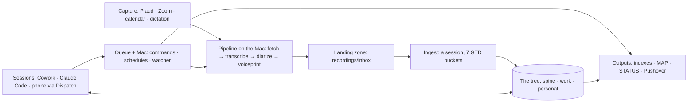
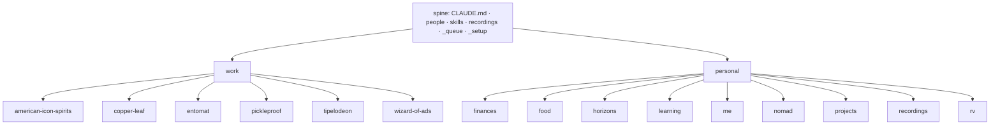
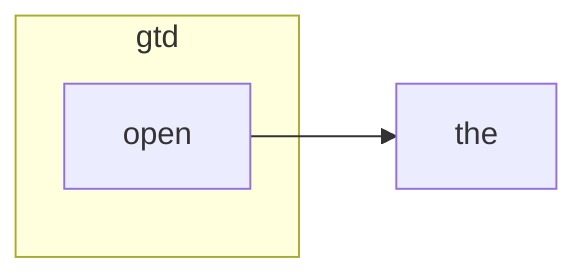
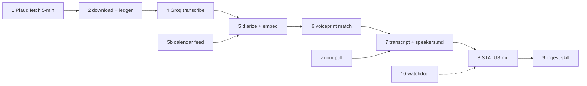

# Sancho · MAP
generated 2026-09-30 by build-map.py. Three zoom levels; Level 0 is the picture to remember.

## FOCUS

# FOCUS   (cap: 3 per lobe per horizon; lint-enforced; hand-set with Gordon, never generated)
## month · 2026-09
work:     Build Sancho · (open) · (open)
personal: (open) · (open) · (open)
## week · 2026-09-30
work:     scaffold + pipeline running · (open) · (open)
personal: (open) · (open) · (open)
## today · 2026-09-30
work:     scaffold the tree · first lint/index/map run · (open)
personal: (open) · (open) · (open)
exceptions this week: 0

## Level 0 · the system

## Level 1 · components

### The tree

### Skills by family

### Pipeline stages

### Active projects

- **Plan the Alaska trip (2027)** (personal/nomad) · next: Read 07-open-questions.md and pick the first one to close
- **Food routine to habit** (personal/food) · next: Design the Sunday session skill (build order #6); first session picks four dinners
- **Nomad daily check** (personal/nomad) · next: Design the personal morning routine incl. the nomad check (build order #5)
- **Build Sancho** (work/copper-leaf) · next: Claude Code on the Mac: watcher, launchd, Sancho-Audio, Sancho-Secrets, Sancho-Private, autocommit fix, ping

## Changed this week

- .gitignore
- CLAUDE.md
- FOCUS.md
- INDEX.md
- MAP.md
- _design/STATUS.md
- _design/Sancho-Architecture-standalone.html
- _design/architecture.md
- _design/build-reading-copy.py
- _design/decisions.md
- _design/migration-plan.md
- _design/postmortem.md
- _design/routines-capture.md
- _design/sancho-architecture.html
- _design/sancho-tree.html
- _design/seeds/goals.md
- _design/seeds/mantras.md
- _design/seeds/to-read.md
- _design/seeds/work-ice.md
- _quarantine/.gitkeep
- _queue/jobs/2026-09-30_build-sancho.md
- _queue/jobs/_archive/.gitkeep
- _setup/ERRORS.md
- _setup/GIT-EXCLUDED.md
- _setup/LINT.md
- _setup/MAC-SETUP.md
- _setup/README.md
- _setup/TESTS.md
- _setup/build-index.py
- _setup/build-map.py
- _setup/com.sancho.autocommit-private.plist
- _setup/com.sancho.nightly.plist
- _setup/com.sancho.pipeline.plist
- _setup/com.sancho.tests.plist
- _setup/com.sancho.watcher.plist
- _setup/commands.md
- _setup/git-autocommit.sh
- _setup/hooks/INDEX.md
- _setup/index-manifest.json
- _setup/install-mac.sh
- _setup/lint-layers.py
- _setup/nightly.sh
- _setup/notify-test.sh
- _setup/notify.py
- _setup/ping.sh
- _setup/pipeline/INDEX.md
- _setup/pipeline/earballs.py
- _setup/pipeline/earballs.sh
- _setup/pipeline/install-venv.sh
- _setup/pipeline/requirements.txt
- _setup/retired/INDEX.md
- _setup/sancho-enqueue.py
- _setup/sancho-lock-secrets.sh
- _setup/sancho-unlock.sh
- _setup/sancho-watcher.py
- _setup/sancho_lib.py
- _setup/stay-awake.sh
- _setup/templates/INDEX.md
- _setup/templates/entity.md
- _setup/templates/guidelines.md
- … +239 more

## Level 2 · wiring

Skills: triggers, reads, writes, tests

| skill | lobe | triggers | must not | reads | writes | test |
|---|---|---|---|---|---|---|
| open | both | Hey Sancho, hey sancho, any greeting addressed to Sancho, let's work, switch to work, switch to personal, done, thanks Sancho, that's it for this one, close | a message that continues an open conversation, a question inside a job, the word sancho used in the third person, a Nerd build session that already stated its task | CLAUDE.md, personal/me/brief.md, personal/me/watch.md, personal/nomad/location.md, <lobe>/INDEX.md, <lobe>/PROJECTS.md, recordings/STATUS.md, _queue/HEALTH.md, _queue/leases/, _queue/sessions/, _queue/routines/<lobe>-morning-<date>.md, the project.md of each project in today's focus, git log since the last clean close | _queue/leases/<session-id>.md, _queue/sessions/<date>_<topic>_<id>.md, on close: a receipt in the session note, the note folded into the project's history or the lobe's day log, the lease removed, a git.commit request in _queue/requests/ | _setup/tests/skills/open/ |

Commands and schedules (from _setup/commands.md)

| ping | _setup/ping.sh | 10 | | round-trip test: writes a result containing the request id |
| index.build | _setup/build-index.py | 120 | after commits; nightly 02:00 | regenerate every INDEX.md, PROJECTS.md, ICE.md, people and skill indexes |
| lint | _setup/lint-layers.py | 120 | before every map build; nightly | layering, caps, headers, generated-file integrity, stale next actions |
| map.build | _setup/build-map.py | 120 | after index.build; nightly | regenerate MAP.md (three zoom levels) |
| docs.reading-copy | _design/build-reading-copy.py | 60 | on demand | rebuild the architecture reading copy and standalone HTML |
| test.all | _setup/test-all.py | 600 | nightly 02:30; after commits touching _setup/ or skills/ | run every test suite; write TESTS.md; exit 1 on any failure |
| git.commit | _setup/git-autocommit.sh | 120 | hourly (launchd direct, not via the queue); at conversation close | commit and push the tree (skips oversize files, lists them in GIT-EXCLUDED.md) |
| nightly | _setup/nightly.sh | 300 | nightly 02:00 (com.sancho.nightly enqueues it) | index.build, then lint, then map.build; stops at the first failure |
| notify.test | _setup/notify-test.sh | 30 | | args [info] / [warn] / [alert]: send one test push to Gordon's phone at that level |
| mac.stay-awake | _setup/stay-awake.sh | 20 | | args [on] / [off] / [status]: keep the Mac from idle-sleeping (caffeinate under launchd) |
| sancho.unlock | _setup/sancho-unlock.sh | 60 | Terminal only | decrypt Sancho-Secrets/sancho.env.age to ~/.config/sancho/env (asks for the passphrase) |
| sancho.lock-secrets | _setup/sancho-lock-secrets.sh | 60 | Terminal only | re-encrypt ~/.config/sancho/env after an edit (asks for the passphrase twice) |
| pipeline.sync | _setup/pipeline/earballs.sh | 3000 | every 5 min (com.sancho.pipeline, launchd direct) | "sync now": Plaud list, download, transcribe, diarize, write recordings/inbox/, STATUS.md; args [sync, --full] for a full reconcile |
| pipeline.backfill | _setup/pipeline/earballs.sh | 7200 | on demand until the fresh overlap is through | args [backfill, --era, auto, --limit, 20]: backlog into recordings/backlog/<era>/, capped at 6 audio-hours a day |
| pipeline.reprocess | _setup/pipeline/earballs.sh | 3000 | | args [reprocess, rec_x, --num-speakers, N]: re-diarize with a confirmed count; writes transcript.vN.md, supersedes speakers.md |
| pipeline.library | _setup/pipeline/earballs.sh | 600 | after ingest confirms speakers | args [library]: rebuild the voiceprint library from human-confirmed speakers.md rows |
| pipeline.status | _setup/pipeline/earballs.sh | 60 | | args [status]: regenerate recordings/STATUS.md |

Scripts

- `_setup/sancho-enqueue.py` · Write one request file to _queue/requests/ (the documented name and frontmatter), optionally wait for its result and print it. Used by launchd schedules and by sessions that have a shell.
- `_setup/sancho-watcher.py` · One tick of the host execution bridge. Runs every allowlisted request in _queue/requests/, writes one result per request to _queue/results/, then rewrites _queue/HEALTH.md. Exits; launchd calls it again on any change to requests/ and every 60 s.
- `_setup/sancho_lib.py` · Shared helpers for Sancho's build scripts: find the tree, read YAML-ish frontmatter without PyYAML, walk files, ask git for last-updated dates.
- `_setup/pipeline/earballs.py` · The recording pipeline. Plaud fetch (incremental every 5 min, full reconcile daily) → download → Groq transcription → pyannote diarization + embeddings → voiceprint match → transcript.md / speakers.md / meta.md in recordings/inbox/ → recordings/STATUS.md → watchdog push. Also backfill, reprocess, library rebuild.
- `_setup/build-index.py` · Regenerate every INDEX.md in the tree (one line per child from frontmatter), each lobe's PROJECTS.md, the ICE views, the people index with completeness, and the skill index. Never hand-edited outputs.
- `_setup/build-map.py` · Regenerate MAP.md, the living map, in three zoom levels: Level 0 the system (one Mermaid diagram, ≤8 boxes), Level 1 components per box, Level 2 wiring tables (reads/writes/triggers/tests/commands/retired). Built only from frontmatter, commands.md and git; no hand-kept registry. Fails if a component has no parsable header or a reads/writes/chain target does not exist.
- `_setup/lint-layers.py` · Enforce the layering rule (architecture §2), the focus caps, the header rule, generated-file integrity, project next-action and waiting-for freshness, and dangling references. Exit 1 on any violation so the map build fails.
- `_setup/notify.py` · Send one Pushover message to Gordon. Level sets priority (info -1, warn 0, alert 1). Deduped per key: sends when the message for a key changes, otherwise at most once a day.
- `_setup/test-all.py` · Run every test under _setup/tests/*/ (test.sh or test.py), write _setup/TESTS.md (the test board), exit 1 if any fails.

LINT.md

# LINT
generated 2026-09-30 by lint-layers.py

**0 problems, 0 warnings**

## Problems (block the build)

## Warnings

TESTS.md

# TESTS
generated 2026-09-30 18:21 by test-all.py · 14 suites · 4 failing

| suite | result | last line |
|---|---|---|
| build-index | PASS | test-build-index: PASS |
| build-map | PASS | test-build-map: PASS |
| git-autocommit | PASS | test-git-autocommit: PASS |
| install-mac | FAIL | test-install-mac: FAIL: install failed |
| lint-layers | PASS | test-lint-layers: PASS |
| nightly | PASS | test-nightly: PASS |
| notify | PASS | test-notify: PASS |
| ping | PASS | test-ping: PASS |
| sancho_lib | PASS | test-sancho_lib: PASS |
| secrets | FAIL | test-secrets: FAIL: age not installed |
| stay-awake | FAIL | test-stay-awake: FAIL: bad plist |
| test-all | PASS | test-test-all: PASS |
| watcher | PASS | test-watcher: PASS |
| skill:open | FAIL | test-skill-open: FAIL |

Retired (90 days)

- INDEX.md

